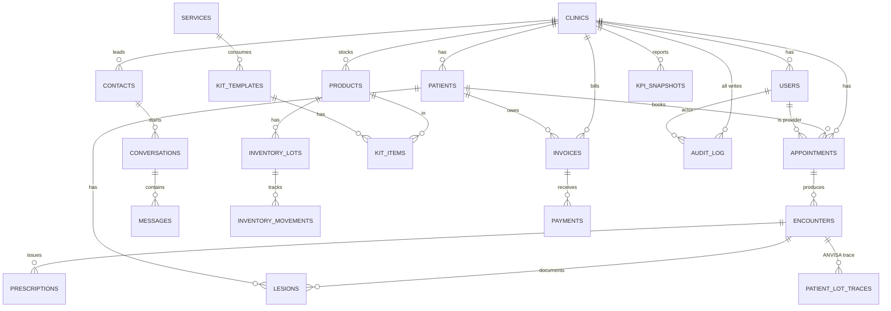

# Banco de Dados — Schemas, RLS e Criptografia

## Diagrama ER de alto nível



## Schemas

| Schema       | Conteúdo                                                                            |
|--------------|-------------------------------------------------------------------------------------|
| `shared`     | Tabelas core multi-tenant: clinics, users, patients, appointments, services, sessions, notifications |
| `clinical`   | Prontuário eletrônico: encounters, prescriptions, protocols, lesions                |
| `omni`       | Omnichannel: contacts (leads), channels, conversations, messages, ai_agents         |
| `supply`     | Estoque: products, suppliers, inventory_lots, movements, kits, purchase_orders, traceability |
| `financial`  | Faturas, pagamentos, caixa, catálogo de serviços                                    |
| `analytics`  | Materialized views, kpi_snapshots, agregações                                       |
| `audit`      | Logs imutáveis: domain_events, audit_log, security_events, lgpd_events              |

## Tabelas principais

### shared.clinics — tenant raiz

Cada clínica é um tenant. `id` é a chave usada por toda a stack para
isolamento (RLS, auditoria, criptografia AAD).

Campos chave:
- `slug` — subdomínio público
- `cnpj` — único, sem formatação
- `business_hours` — JSONB com horário por dia da semana
- `cnes`, `crf`, `afe` — registros regulatórios (ANVISA, conselhos)
- `plan_limits` — JSONB com cap de pacientes/usuários por plano

### shared.users

Profissionais e administradores da clínica. Login com argon2id, RBAC por
`role` (enum `shared.user_role`):

`owner` > `admin` > `dermatologist` ≈ `nurse` > `receptionist` ≈
`financial` > `readonly`.

Campos de segurança: `password_version` (incrementa em changePassword
para invalidar sessões antigas), `failed_login_attempts`, `locked_until`,
`known_ip_hashes`.

### shared.patients

PHI completo, com criptografia AES-256 nos campos sensíveis:

- Texto cifrado: `name`, `cpf_encrypted`, `email_encrypted`,
  `phone_encrypted`, `phone_secondary_encrypted`, `address` (JSONB string).
- Texto claro auxiliar: `name_search` (lowercase, sem acentos — para
  ILIKE/trigram), `cpf_hash` (HMAC para WHERE = lookup).
- Não-PHI: `birth_date`, `gender`, `blood_type`, `allergies[]`,
  `chronic_conditions[]`, `total_visits`, `last_visit_at`.
- LGPD: `deleted_at` (soft delete), `deletion_reason`.

### shared.appointments

Agenda. `status_history` JSONB mantém todas as transições de status com
timestamp + `changed_by`. `source` discrimina origem (manual,
online_booking, whatsapp, walk_in, referral).

### clinical.encounters

Prontuário SOAP (Subjective, Objective, Assessment, Plan). Campos
clínicos texto livre. Quando `signed_at IS NOT NULL`, encounter vira
imutável (UPDATE bloqueado por trigger). `signature_hash` é SHA-256 do
conteúdo no momento da assinatura — qualquer mudança detectável.

### supply.inventory_lots / inventory_movements / patient_lot_traces

Pilar de rastreabilidade ANVISA:

- `inventory_lots` — fonte da verdade do estoque por lote.
  `quantity_initial`, `quantity_current`, `expiry_date`,
  `is_quarantined`. `unit_cost` para FEFO + custo médio.
- `inventory_movements` — histórico imutável (sem `updated_at`).
  `type` ∈ {entrada, saida, ajuste, perda, vencimento, transferencia,
  uso_paciente}. `reference_type/reference_id` aponta para o documento
  originário.
- `patient_lot_traces` — append-only com trigger que bloqueia
  UPDATE/DELETE. Liga lote → paciente → encounter. ANVISA exige.

### audit.domain_events

Event sourcing leve: cada `eventBus.publish` persiste antes de emitir.
Permite replay em caso de bug em handler downstream. Particionado por
mês em produção.

### audit.audit_log

Toda escrita autenticada gera entry. `actor_type` ∈ {user, patient,
system}, `entity_type/entity_id`, `before/after` JSONB para mudanças
materiais. Imutável por trigger.

---

## Row-Level Security (RLS)

### Como funciona

Cada tabela com `clinic_id` tem RLS habilitado:

```sql
ALTER TABLE shared.patients ENABLE ROW LEVEL SECURITY;

CREATE POLICY patients_isolation ON shared.patients
  USING (clinic_id = current_setting('app.current_clinic_id', true)::uuid);
```

A variável de sessão `app.current_clinic_id` é setada no início de cada
transação pelo middleware de auth da API:

```ts
// apps/api/src/db/client.ts
await withClinicContext(clinicId, async (client) => {
  await client.query(`SET LOCAL app.current_clinic_id = $1`, [clinicId]);
  return callback(client);
});
```

`SET LOCAL` garante que a variável só vale dentro da transação — não vaza
para outras conexões do pool.

### Como testar

Test pattern em `apps/api/src/__tests__/integration/rls-smoke.test.ts`:

```ts
await client.query(`SET LOCAL app.current_clinic_id = $1`, [clinicB.id]);
const result = await client.query(`SELECT * FROM shared.patients WHERE id = $1`, [patientFromA.id]);
expect(result.rowCount).toBe(0);  // RLS oculta a linha
```

O smoke test (`scripts/smoke-test.sh`) executa este teste como GATE
obrigatório antes de deploy — falha = exit 1.

### Como adicionar em nova tabela

```sql
ALTER TABLE schema.nova_tabela ENABLE ROW LEVEL SECURITY;

CREATE POLICY nova_tabela_isolation ON schema.nova_tabela
  USING (clinic_id = current_setting('app.current_clinic_id', true)::uuid);

-- Para roles privilegiadas (worker, migration), adicione BYPASS:
ALTER TABLE schema.nova_tabela FORCE ROW LEVEL SECURITY;
GRANT BYPASSRLS_PRIVILEGE TO dermaos_worker; -- se necessário
```

Verificar em PR review:

- Policy presente.
- Tabela tem coluna `clinic_id` NOT NULL FK clinics.
- Tabela está coberta por test em `rls-smoke.test.ts`.

### Caso especial: notifications

`shared.notifications` usa policy por `user_id` (não por `clinic_id`)
porque é dado pessoal de cada usuário:

```sql
CREATE POLICY notifications_user_isolation ON shared.notifications
  USING (user_id = current_setting('app.current_user_id', true)::uuid);
```

---

## Estratégia de migrations

### Convenção de nomenclatura

`db/init/NNN_descricao_curta.sql`. Numeração por dezenas:

- `001-009` — extensões PostgreSQL e schemas
- `010-019` — clinical
- `020-029` — omni
- `030-039` — supply
- `040-049` — financial / worker / observabilidade
- `050+` — analytics
- `060` — seed data legado (ver `scripts/seed-rich.ts` para alternativa)

Migrations devem ser **idempotentes** sempre que possível:

```sql
CREATE TABLE IF NOT EXISTS schema.t (...);
ALTER TABLE schema.t ADD COLUMN IF NOT EXISTS ...;
CREATE INDEX IF NOT EXISTS idx_... ON schema.t (...);
```

### Como criar nova migration

```bash
# 1. Criar arquivo com próximo número livre
touch db/init/050_minha_feature.sql

# 2. Escrever DDL idempotente
# 3. Aplicar local
pnpm db:migrate

# 4. Verificar que test:integration passa (testcontainers reaplica do zero)
pnpm test:integration
```

### Como fazer rollback

DermaOS NÃO usa migrations reversíveis automaticamente. Para reverter:

1. Criar nova migration `0XX_revert_NNN.sql` com `DROP/ALTER` explícito.
2. Em produção, NUNCA rodar `DROP COLUMN` sem janela de manutenção e
   backup recente — verificar `DEPLOYMENT.md`.
3. Para mudanças destrutivas, sempre planejar em duas migrations:
   - `add column nullable` + deploy + populate
   - `set NOT NULL` + deploy seguinte

---

## Índices críticos

Índices que removemos por engano = produção lenta. Lista de protegidos:

| Índice                                            | Por quê crítico                                |
|---------------------------------------------------|------------------------------------------------|
| `idx_patients_cpf_hash`                           | Lookup por CPF (login portal, deduplicação)    |
| `idx_patients_name_search` (gin trigram)          | Busca textual no /patients/search              |
| `idx_appointments_scheduled_at` partial           | Calendário (range scan por data)               |
| `idx_inventory_lots_available` partial            | FEFO (ORDER BY expiry_date)                    |
| `idx_inventory_movements_clinic_date`             | Auditoria de estoque por período               |
| `idx_audit_log_clinic_created` (BRIN ou btree)    | Trilha de auditoria por clínica                |
| `idx_notifications_user_unread` partial           | Badge de não lidas (alta frequência)           |
| `idx_messages_clinic_status` partial              | Inbox real-time                                |

Antes de remover qualquer índice, rodar `EXPLAIN ANALYZE` da query que ele
serve, com volume de produção.

---

## Campos criptografados

Lista mantida em [ADR-002](ADR/002-encryption-strategy.md). Resumo:

| Tabela                | Campo                       | Tipo            | Lookup auxiliar           |
|-----------------------|-----------------------------|-----------------|---------------------------|
| shared.patients       | name                        | TEXT enc        | name_search (lowercase)   |
| shared.patients       | cpf_encrypted               | TEXT enc        | cpf_hash (HMAC)           |
| shared.patients       | email_encrypted             | TEXT enc        | email_hash (HMAC)         |
| shared.patients       | phone_encrypted             | TEXT enc        | phone_hash (HMAC)         |
| shared.patients       | address                     | JSONB-as-string |  -                        |
| clinical.encounters   | chief_complaint, subjective, objective, assessment, plan | TEXT enc | -          |
| clinical.prescriptions | items.dosage / instructions | JSONB enc      | -                         |
| omni.messages         | content                     | TEXT enc        | -                         |

Uso na app:

```ts
import { encrypt, decrypt, deterministicHash } from '../lib/encryption.js';

// Criptografar
const cipher = encrypt('CPF: 12345678900', { clinicId });

// Lookup determinístico
await db.query(
  `SELECT id FROM shared.patients WHERE clinic_id = $1 AND cpf_hash = $2`,
  [clinicId, deterministicHash('12345678900')],
);

// Descriptografar
const { plaintext, staleVersion } = decrypt(cipher, { clinicId });
if (staleVersion) {
  // Re-write opportunistically — chave foi rotacionada
  await db.query(`UPDATE ... SET cpf_encrypted = $1 WHERE id = $2`,
    [encrypt(plaintext, { clinicId }), id]);
}
```

---

## Atualizando este documento

A cada migration que afeta schema (DDL):

1. Atualizar diagrama ER se a relação for nova ou removida.
2. Atualizar tabela de "campos criptografados" se houver mudança.
3. Atualizar tabela de "índices críticos" se um índice virar load-bearing.
4. Confirmar que test em `rls-smoke.test.ts` cobre a nova tabela.
