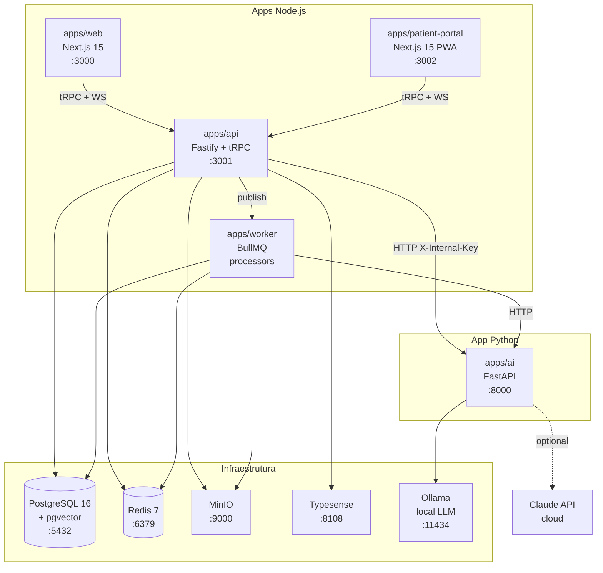

# DermaOS — Documentação Técnica

## Visão geral

DermaOS é uma plataforma all-in-one para clínicas dermatológicas que combina
gestão clínica (prontuário, prescrições, lesões), agenda, omnichannel
(WhatsApp/Instagram), estoque com rastreabilidade ANVISA, financeiro,
analytics e portal do paciente — tudo multi-tenant com isolamento por
Row-Level Security e dados sensíveis criptografados na aplicação.

---

## Arquitetura



Fluxo resumido:

- **web** atende a equipe da clínica; **patient-portal** atende o paciente
  final; ambos consomem a **api** via tRPC + Socket.io.
- **api** é o ponto único de entrada (Fastify): autenticação, RBAC, RLS,
  domínio, eventos, persistência.
- **worker** consome filas BullMQ — jobs longos (consumo de kit FEFO,
  lembretes, exports LGPD, agregação analytics).
- **ai** é Python/FastAPI: previsões locais via Ollama para PHI;
  agregados não-PHI podem usar Claude API.

---

## Como rodar localmente

### Pré-requisitos

- Docker Desktop ≥ 4.x
- Node.js ≥ 22 LTS
- pnpm ≥ 9
- 16 GB RAM (8 GB mínimo, mas Ollama puxa 4-6 GB sozinho)

### Setup do zero

```bash
git clone <repo> dermaos && cd dermaos

# 1. Setup completo: Docker + .env + migrations + dependências
./scripts/setup.sh

# 2. Popular dados de demo
pnpm db:seed

# 3. Iniciar tudo em modo dev
pnpm dev
```

URLs após `pnpm dev`:

- Web (clínica):       http://localhost:3000
- Portal do paciente:  http://localhost:3002
- API:                 http://localhost:3001
- API health:          http://localhost:3001/health
- API readiness:       http://localhost:3001/ready
- MinIO console:       http://localhost:9001
- pgAdmin (dev):       http://localhost:5050

Credenciais de demo (do `pnpm db:seed`): senha `admin123` para o admin —
**troque antes de qualquer uso fora de dev local**.

### Testes

```bash
pnpm test               # tudo (unit + integration + e2e)
pnpm test:unit          # vitest unit only
pnpm test:integration   # com testcontainers (PG + Redis)
pnpm test:e2e           # playwright contra o stack rodando
pnpm smoke              # smoke test end-to-end (RLS + RBAC gates)
```

### Build de produção

```bash
pnpm build       # turbo build paralelo
pnpm docker:prod # sobe o stack com docker-compose.prod.yml
```

---

## Estrutura de diretórios

```
dermaos/
├── apps/
│   ├── api/             # Fastify + tRPC — ponto de entrada
│   ├── web/             # Next.js 15 — interface da clínica
│   ├── patient-portal/  # Next.js PWA — interface do paciente
│   ├── worker/          # BullMQ workers (jobs longos)
│   └── ai/              # FastAPI Python — predições e Claude
├── packages/
│   ├── shared/          # Zod schemas + types compartilhados
│   └── ui/              # Design system: tokens + componentes
├── db/init/             # Migrations SQL ordenadas (001_, 010_, ...)
├── docs/
│   ├── ADR/             # Architecture Decision Records
│   ├── API.md           # Endpoints tRPC + REST + códigos de erro
│   ├── DATABASE.md      # Schemas, RLS, criptografia, ER diagram
│   ├── DEPLOYMENT.md    # Setup local, produção, backup, monitoring
│   └── SECURITY.md      # Modelo de ameaças STRIDE + LGPD + IR
├── e2e/                 # Playwright tests
├── nginx/               # Reverse proxy (produção)
├── scripts/
│   ├── setup.sh         # Bootstrap completo
│   ├── migrate.sh       # Aplicar migrations
│   ├── seed.sh          # Seed básico (idempotente)
│   ├── seed-rich.ts     # Seed enriquecido com Faker pt-BR
│   ├── smoke-test.sh    # Smoke test (RLS + RBAC gates)
│   └── backup.sh        # Backup PG + MinIO
└── docker-compose.yml   # Stack base (dev e prod)
```

---

## Padrões de código

### Nomenclatura

| Camada                | Convenção          | Exemplo                          |
|-----------------------|--------------------|----------------------------------|
| TypeScript variáveis  | camelCase inglês   | `patientId`, `clinicId`          |
| TypeScript componentes| PascalCase inglês  | `PatientCard`, `BodyMap`         |
| Banco — tabelas       | snake_case inglês  | `inventory_lots`, `kit_items`    |
| Banco — colunas       | snake_case inglês  | `created_at`, `clinic_id`        |
| Arquivos              | kebab-case         | `patient-card.tsx`, `auth-mw.ts` |
| Comentários (negócio) | português          | `// FEFO: lote venc. mais próximo`|
| Comentários (técnico) | inglês             | `// memoize to avoid re-render`  |

### Estrutura de módulo

```
apps/api/src/modules/<dominio>/
├── <dominio>.router.ts    # tRPC: input zod, output zod, mutations/queries
├── <dominio>.service.ts   # Lógica de negócio (puro, sem Fastify dep)
└── <dominio>.types.ts     # Types/interfaces internas
```

Camadas:

- **Router** valida input com Zod, chama auth/RBAC middleware, delega ao service.
- **Service** orquestra: faz queries, publica eventos, retorna DTOs.
- **Repository pattern não é forçado** — para queries simples o service
  chama `ctx.db.query` direto. Para queries complexas, extrai funções helper
  em arquivos `<dominio>.repo.ts`.

### Como criar novo módulo

1. Criar diretório em `apps/api/src/modules/<nome>/`.
2. Adicionar `<nome>.router.ts` e registrar em
   [apps/api/src/trpc/router.ts](../apps/api/src/trpc/router.ts).
3. Schemas Zod compartilhados (front + back) em `packages/shared/src/schemas/`.
4. Migration nova em `db/init/0XX_<nome>.sql` — numeração sequencial.

### Como criar nova migration

```bash
# Numeração: próximo número livre em db/init/
# Convenção: NNN_descricao_curta.sql, lowercase

# Edite db/init/050_<descricao>.sql
# Aplique:
pnpm db:migrate
```

Migrations são idempotentes (`CREATE TABLE IF NOT EXISTS`, `ALTER ... IF NOT
EXISTS`) sempre que possível. Para mudanças destrutivas, criar migration
separada de cleanup com revisão humana.

---

## Documentação relacionada

- [API.md](API.md) — autenticação, tRPC procedures, REST endpoints,
  códigos de erro.
- [DATABASE.md](DATABASE.md) — diagrama ER, schemas, RLS, criptografia.
- [DEPLOYMENT.md](DEPLOYMENT.md) — setup local, produção, backup, monitoring.
- [SECURITY.md](SECURITY.md) — modelo STRIDE, LGPD, incident response.

### Architecture Decision Records (ADRs)

Cada decisão arquitetural relevante é documentada em [docs/ADR/](ADR/):

- [ADR-001](ADR/001-trpc-vs-rest.md) — tRPC interno + REST para webhooks
- [ADR-002](ADR/002-encryption-strategy.md) — Criptografia AES-256-GCM por tenant
- [ADR-003](ADR/003-patient-portal-isolation.md) — Sessão isolada do portal
- [ADR-004](ADR/004-fefo-vs-fifo.md) — FEFO para controle de lotes

Para criar novo ADR, copiar template `ADR/000-template.md` e numerar
sequencialmente. Manter status (Proposed / Accepted / Superseded).

---

## Atualizando esta documentação

| Documento     | Responsável                  | Quando atualizar                                         |
|---------------|------------------------------|----------------------------------------------------------|
| README.md     | Tech Lead                    | Mudança de stack, processo de setup, ou estrutura macro  |
| ADR/*         | Quem propõe a decisão        | Ao tomar decisão arquitetural relevante                  |
| API.md        | Tech Lead + autor da rota    | A cada nova procedure tRPC ou rota REST                  |
| DATABASE.md   | DBA / Backend Lead           | A cada migration de schema (mudança em `db/init/`)       |
| DEPLOYMENT.md | DevOps / SRE                 | A cada mudança em docker-compose, env, ou runbook        |
| SECURITY.md   | Security Lead / DPO          | A cada incidente, mudança de criptografia, ou auditoria  |

Toda documentação é em **português (pt-BR)** para a equipe local.
Comentários em código permanecem em **inglês** (padrão da indústria) exceto
quando explicam regra de negócio específica do domínio brasileiro
(LGPD, ANVISA, CRM, CFM).
